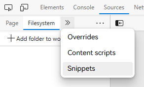
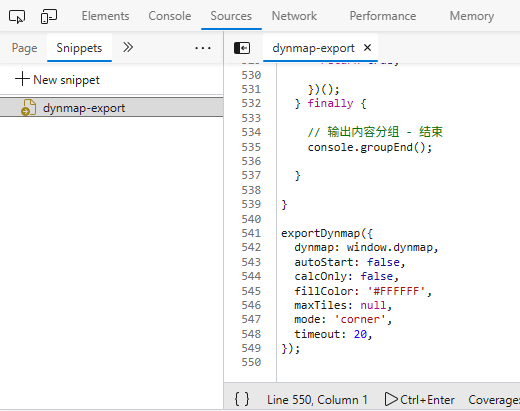

# dynmap-export-js

## 简介

在浏览器中将 Dynmap 网页地图上的地图图片合并导出为一张图片。

## 参数说明

- `dynmap`

  指定网页地图页面对外暴露的 `dynmap` 对象。

- `autoStart`

  是否自动开始（不需要执行函数进行确认）。

- `calcOnly`

  是否只输出导出范围信息。

- `fillColor`

  图片空白区域的颜色。

- `maxTiles`

  最多可以请求的地图图片数量，若超出则停止请求并返回结果。

- `mode`

  指定导出模式。

  目前有两个模式，均为导出**已浏览过**的区域（即执行代码前需要**通过手动拖动**的方式让浏览器加载地图）。

  `corner` 模式会根据已加载的地图区域计算出矩形范围进行导出，而 `viewed` 模式则只导出已加载的地图区域。

- `timeout`

  确认导出前的等待秒数，若超时则自动取消导出。

## 使用方法

1. 访问网页地图页面。
2. 切换到需要导出的地图并调整到合适的缩放比例。
3. 打开浏览器的开发人员工具（DevTools）。
4. 切换到“Sources（源代码）”标签页。
5. 打开“Snippets（代码片段）”工具。

   

6. 创建新的代码片段，将 `dynmap-export.js` 或 `dynmap-export.min.js` 文件中的代码粘贴到其中。

7. 在代码的末尾添加 `exportDynmap({ ...参数 })` 以调用。

   


   示例调用方式：

   ```javascript
   exportDynmap({
     dynmap: window.dynmap,
     autoStart: false,
     calcOnly: false,
     fillColor: '#FFFFFF',
     maxTiles: null,
     mode: 'corner',
     timeout: 20,
   });
   ```

7. 在网页中拖动地图以加载需要导出的区域。
8. 回到 DevTools，点击“代码片段”页面左下角的执行按钮。

   若 `autoStart` 参数设为 `false`，则需要切换到“Console（控制台）”标签页，执行提示的函数（`confirmExport()`）。
